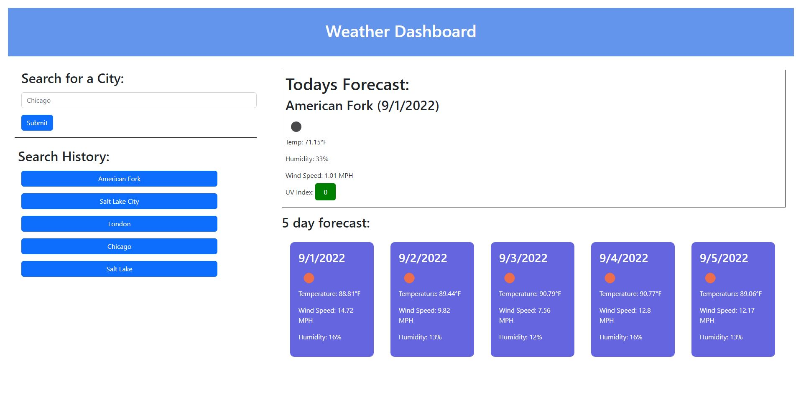

# weather-dashboard
## Description
This is a website coded with HTML, CSS, and JavaScript to pull information from the [Open Weather One Call API 3.0](https://openweathermap.org/api/one-call-3) to display weather information about a searched city. It uses localstorage to store persistant search history.
## Links
[Github Repo](https://github.com/Jacee94/weather-dashboard)  
[Deployed Application](https://jacee94.github.io/weather-dashboard/)
## Screenshot
